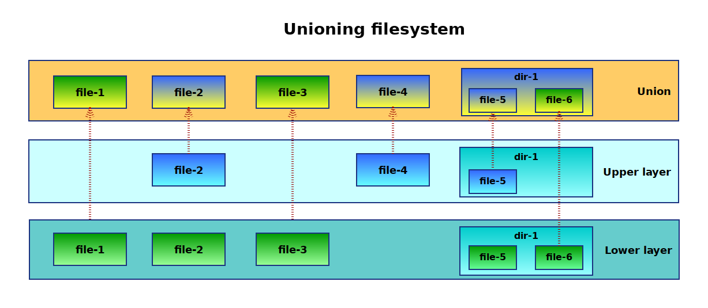
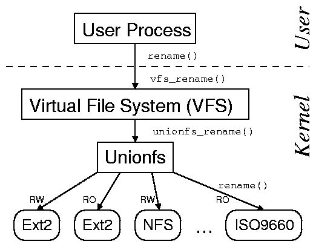
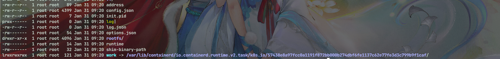

# containerd的进程迁移

最近需要对containerd实现进程迁移，来迁移pod，需要对containerd有一个深入的了解

## [Union Mount File Systems](https://en.wikipedia.org/wiki/Union_mount)




计算机中，Union Mounting是一种**将多个不同的目录组合成一个统一的目录视图的技术**；Union Mounting技术在Linux，FreeBSD，[Plan9](https://en.wikipedia.org/wiki/Plan_9_from_Bell_Labs)中都有相似的设计；Union Mount技术并不直接参与磁盘空间结构的划分和inode的管理，它依赖并建立在现有操作系统的文件系统之上（ext4，exFAT等）。


### Union Mount实现

- [overlayfs](https://www.kernel.org/doc/html/latest/filesystems/overlayfs.html?highlight=overlayfs)
- [aufs](https://en.wikipedia.org/wiki/Aufs)
- [UnionFS](https://dl.acm.org/doi/fullHtml/10.5555/1044970.1044978)




下面我们以`overlayfs`为例子看一下对应的containerd的使用

我们可以看一下主流的`overlayfs`的用法：

```shell
mount -t overlay overlay -olowerdir=/lower,upperdir=/upper,workdir=/work /merged
```

有几个关键参数需要关注`lower`、`upper`、`merged` 

`Workdir`必须是与`upperdir`同一文件系统上的空目录。

而下面我们在containerd中提到的Bundle就是`merged`

`merged` 对应目录为：`/run/containerd/io.containerd.runtime.v2.task/k8s.io/{id}`

`lower`对应的目录：`/var/lib/containerd/io.containerd.content.v1.content`

`upper`对应的目录：`/var/lib/containerd/io.containerd.snapshotter.v1.overlayfs`

可以看一下containerd中一个启动的container `merged`的目录

 

```text
root@node-2:/run/containerd/io.containerd.runtime.v2.task/k8s.io/57438e8a97fcc0a1191f872bb000b274dbf6fe1137c62e77fe3d3c799b9f1caf# ll
total 32
drwx------  3 root root  240 Jan 31 09:20 ./
drwx--x--x 12 root root  240 Jan 31 09:20 ../
-rw-r--r--  1 root root   89 Jan 31 09:20 address
-rw-r--r--  1 root root 4399 Jan 31 09:20 config.json
-rw-r--r--  1 root root    7 Jan 31 09:20 init.pid
prwx------  1 root root    0 Jan 31 09:20 log|
-rw-r--r--  1 root root    0 Jan 31 09:20 log.json
-rw-------  1 root root   54 Jan 31 09:20 options.json
drwxr-xr-x  1 root root 4096 Jan 31 09:20 rootfs/
-rw-------  1 root root   14 Jan 31 09:20 runtime
-rw-------  1 root root   32 Jan 31 09:20 shim-binary-path
lrwxrwxrwx  1 root root  121 Jan 31 09:20 work -> /var/lib/containerd/io.containerd.runtime.v2.task/k8s.io/57438e8a97fcc0a1191f872bb000b274dbf6fe1137c62e77fe3d3c799b9f1caf/
```


## Bundle

首先我们在pod的创建流程中，会调用CRI的`RunPodSandbox` 之后会创建一个[Bundle](https://github.com/opencontainers/runtime-spec/blob/main/bundle.md) 这里也是容器的实际运行时用到的文件目录

`Bundle` : rootfs+config

> # containerd changes to the bundle
>
> Containerd will make changes to the container's bundle by adding additional files or folders by default with options to change the output.
>
> The current change that it makes is if you create a checkpoint of a container, the checkpoints will be saved by default in the container bundle at `{bundle}/checkpoints/{checkpoint name}`. A user can also populate this directory and provide the checkpoint name on the create request so that the container is started from this checkpoint.
>
> As of this point, containerd has no other additions to the bundle. Runtime state is currently stored in a tmpfs filesystem like `/run`.

这里有一篇关于OCI bundle的信息

> https://chromium.googlesource.com/external/github.com/docker/containerd/+/refs/tags/v0.2.0/docs/bundle.md

在containerd中有关于OCI的标准对照

> https://github.com/containerd/containerd/blob/main/docs/content-flow.md

在containerd中bundle的目录为`/run/containerd/io.containerd.runtime.v2.task/k8s.io/{id}`


## shim

接下来会调用`shim`的相关流程包括`newShimTask` 、`CreateSandbox` 等

实际上在创建podsanbox


后续由kubelet 调用`StartContainer` 来进行容器的启动调用`container.NewTask` 进行容器的启动

之后会进行Shim的创建

```go
		// get the rootfs from the snapshotter and add it to the request
		s, err := c.client.getSnapshotter(ctx, r.Snapshotter)
		if err != nil {
			return nil, err
		}
		mounts, err := s.Mounts(ctx, r.SnapshotKey)
		if err != nil {
			return nil, err
		}
		spec, err := c.Spec(ctx)
		....
		info := TaskInfo{
		runtime: r.Runtime.Name,
	}
		....
	response, err := c.client.TaskService().Create(ctx, request)
```

```go
func (m *TaskManager) Create(ctx context.Context, id string, opts runtime.CreateOpts) (_ runtime.Task, retErr error) {
    bundle, err := NewBundle(ctx, m.root, m.state, id, opts.Spec.Value)
     //  启动containerd-shim进程
    shim, err := m.startShim(ctx, bundle, id, opts)
    //  向第二个containerd-shim发送create指令
    t, err := shim.Create(ctx, opts)
    if err := m.tasks.Add(ctx, t); err != nil 
    return t, nil
}

func (b *binary) Start(ctx context.Context, opts *types.Any, onClose func()) (_ *shim, err error) {
    args := []string{"-id", b.bundle.ID}
    args = append(args, "start")
    cmd, err := client.Command(
        ctx,
        b.runtime,
        b.containerdAddress,
        b.containerdTTRPCAddress,
        b.bundle.Path,
        opts,
        args...,
    )
    out, err := cmd.CombinedOutput()
    // 返回一个unix socket
    address := strings.TrimSpace(string(out))
    conn, err := client.Connect(address, client.AnonDialer)
   // 新建与unix socket的连接
    client := ttrpc.NewClient(conn, ttrpc.WithOnClose(onCloseWithShimLog))
    return &shim{
        bundle:  b.bundle,
        client:  client,
        task:    task.NewTaskClient(client),
        events:  b.events,
        rtTasks: b.rtTasks,
    }
}

// 第二个containerd-shim启动grpc服务
func (s *Client) Serve() {
    shimapi.RegisterTaskService(server, s.service)
}
```

这个shim非常关键因为我们如果启动了pod以后直接执行ctr的checkpoint的话没什么问题，但是如果我们删除pod后再进行restore会发生如下问题

```text
ctr: OCI runtime restore failed: Requested network namespace /proc/2848175/ns/net does not exist: unknown
```

这个问题的产生就是因为pod层因为对于网络的关系所以建立了自己的namespace可以让所有的container网络互通，而如果pod删除以后这层就消失了，所以我们的问题关键就是如果要对pod进行checkpoint一定要把shim给一起包住，这个是很关键的点具体产生的代码如下

```go
		// We don't need stdio for sandbox container.
	task, err := container.NewTask(ctx, containerdio.NullIO, taskOpts...)
	.......
if !hostNetwork(config) && userNsEnabled {
	........
		sandbox.NetNS, err = netns.NewNetNSFromPID(netnsMountDir, task.Pid())
  .......
 }
```

## pod checkpoint

这时候我们来看一下针对containerd的checkpoint CRIU维护者提的PR

> https://github.com/containerd/containerd/pull/6965

```go
	container, err := c.containerStore.Get(r.GetContainerId())
	.....	
	task, err := container.Container.Task(ctx, nil)
	.......
 	_, err = task.Checkpoint(
 		ctx,
 		[]containerd.CheckpointTaskOpts{withCheckpointOpts(
 			i.Runtime.Name,
 			r.GetLocation(),
 			c.getContainerRootDir(r.GetContainerId()),
 			string(configJSON),
 			exportToArchive,
 		)}...,
 	)
```

首先获取task之后和ctr的checkpoint流程是一样的，so network的namespace问题并没有解决，问题来到了netns这边。


那么我们再来看一下CRI-O的工程流程

## CRI-O 工作流程

CRI-O 架构组合了很多开源的基础组件，下面我们结合 Kubernetes，来看一下 CRI-O 的工作流程：


- Kubernetes 通知 kubelet 启动一个 pod。
- kubelet 通过 CRI 将请求转发给 CRI-O Daemon。
- CRI-O 利用 containers/image 库从镜像仓库拉取镜像。
- 下载好的镜像被解压到容器的根文件系统中，并通过 containers/storage 库存储到 COW 文件系统中。
- 为容器创建 rootfs 之后，CRI-O 通过 oci-runtime-tool 生成一个 OCI 运行时规范 json 文件，描述如何使用 OCI Generate tools 运行容器。
- 然后 CRI-O 启动一个兼容 CRI 的运行时（默认 runc）来运行容器进程。
- 每个容器都由一个独立的 conmon 进程监控，conmon 为容器中 pid 为 1 的进程提供一个 pty。同时它还负责处理容器的日志记录并记录容器进程的退出代码。
- 网络是通过 CNI 接口设置的，所以任何 CNI 插件都可以与 CRI-O 一起使用。


在看了CRI-O以后我们可以发现，CRI-O是直接启动的`Pause` 进程没有所谓的shim，代码里也是直接

```go
sbox.InitInfraContainer(&s.config, &podContainer)
```

CRI-O是直接调用的conmon restore和runc\crun通讯

> 关于conmon
>
> An OCI container runtime monitor.
>
> Conmon is a monitoring program and communication tool between a container manager (like [Podman](https://podman.io/) or [CRI-O](https://cri-o.io/)) and an OCI runtime (like [runc](https://github.com/opencontainers/runc) or [crun](https://github.com/containers/crun)) for a single container.

这是common对于restore的处理

```c
char *command;
		if (opt_restore_path)
			command = "restore";
		else
			command = "create";

		add_argv(runtime_argv, command, "--bundle", opt_bundle_path, "--pid-file", opt_container_pid_file, NULL);
		if (opt_no_pivot)
			add_argv(runtime_argv, "--no-pivot", NULL);
		if (opt_no_new_keyring)
			add_argv(runtime_argv, "--no-new-keyring", NULL);

		if (opt_restore_path) {
			/*
			 * 'runc restore' is different from 'runc create'
			 * as the container is immediately running after
			 * a restore. Therefore the '--detach is needed'
			 * so that runc returns once the container is running.
			 *
			 * '--image-path' is the path to the checkpoint
			 * which will be become important when using pre-copy
			 * migration where multiple checkpoints can be created
			 * to reduce the container downtime during migration.
			 *
			 * '--work-path' is the directory CRIU will run in and
			 * also place its log files.
			 */
			add_argv(runtime_argv, "--detach", "--image-path", opt_restore_path, "--work-path", opt_bundle_path, NULL);
```

有趣的是有c的地方就有rust https://github.com/containers/conmon-rs 明显rust的文档比c要全一些


### 如何解决namespace问题

在CRI-O的restore流程中我们可以看到下面代码

```go
	// Get config.json
	// This file is generated twice by earlier code. Once in BundlePath() and
	// once in Dir(). This code takes the version from Dir(), modifies it and
	// overwrites both versions (Dir() and BundlePath())
	ctrSpec, err := generate.NewFromFile(filepath.Join(ctr.Dir(), "config.json"))

	sb, err := c.LookupSandbox(ctr.Sandbox())

// We need to adapt the to be restored container to the sandbox created for this container.

	// The container will be restored in another sandbox. Adapt to
	// namespaces of the new sandbox
	for i, n := range ctrSpec.Config.Linux.Namespaces {
		if n.Path == "" {
			// The namespace in the original container did not point to
			// an existing interface. Leave it as it is.
			// CRIU will restore the namespace
			continue
		}
		for _, np := range sb.NamespacePaths() {
			if string(np.Type()) == string(n.Type) {
				ctrSpec.Config.Linux.Namespaces[i].Path = np.Path()
				break
			}
		}
	}
```

这里首先读取了OCI规范的config.json，之后把config.json直接修改为了当前运行的pod的namespace

在runc里我们也可以看到读取namespace是如何读取的

```go
func startContainer(context *cli.Context, action CtAct, criuOpts *libcontainer.CriuOpts) (int, error) {
	......
	spec, err := setupSpec(context)
  ...
}

func setupSpec(context *cli.Context) (*specs.Spec, error) {
	bundle := context.String("bundle")
	if bundle != "" {
		if err := os.Chdir(bundle); err != nil {
			return nil, err
		}
	}
	spec, err := loadSpec(specConfig)
	if err != nil {
		return nil, err
	}
	return spec, nil
}

specConfig = "config.json"
```

所以实际上就是读的bundle中的config.json 这也是OCI规范


## 如何实现containerd的checkpoint

首先我们根据上文的理解我们可以得知，checkpoint的始终是container，CRI的所有接口中几乎都是对container为单位设计的，所以我们一定要去兼容pod。


/var/lib/kubelet/checkpoints


首先分析CRI-O支持checkpoints做了哪些修改

> https://github.com/cri-o/cri-o/commit/0244fee08468720b7acef7b4f624d7954fc93eda#diff-e88b1548794adb58564ef46a2b8b7b892ca2056d5b25646a867c4b875da9bc7f

containerd以插件的形式运行镜像的各种操作

```go
plugin.Register(&plugin.Registration{
		Type: plugin.MetadataPlugin,
		ID:   "bolt",
		Requires: []plugin.Type{
			plugin.ContentPlugin,
			plugin.SnapshotPlugin,
		},
		Config: &BoltConfig{
			ContentSharingPolicy: SharingPolicyShared,
		},
  .....
}
```


首先我们有2个思路。

1. 直接打包成一个新的OCI镜像，添加一层新目录，之后上传这个镜像
2. 导出当前层镜像为一个tar，之后利用这个tar来打出一个新镜像，然后上传这个镜像，之后解压处理，还需要恢复原始镜像
