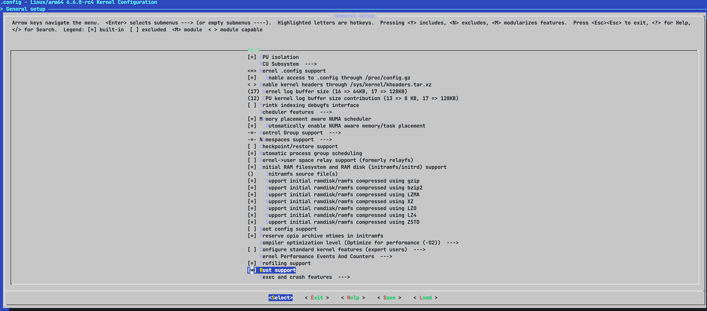

# rust for linux

## 1. 背景 

Rust for Linux 这个项目的目的就是为了将 Rust 引入 Linux，让 Rust 成为 C 语言之后的第二语言。但它最初的目的是：实验性地支持Rust来写内核驱动。

以往，Linux 内核驱动的编写相对于应用其实是比较复杂的，具体复杂性主要表现在以下两个方面：

- 编写设备驱动必须了解Linux 内核基础概念、工作机制、硬件原理等知识
- 设备驱动中涉及内存和多线程并发时容易出现 Bug，linux驱动跟linux内核工作在同一层次，一旦发生问题，很容易造成内核的整体崩溃

引入 Rust 从理想层面来看，一方面在代码抽象和跨平台方面比 C 更有效，另一方面代码质量会更高，有效减少内存和多线程并发类 Bug 。但具体实践如何，是否真如理想中有效，这就需要后续的实验。

Rust for Linux 就是为了帮助实现这一目标，为 Linux 提供了 Rust 相关的基础设施和方便编写 Linux 驱动的安全抽象。

### [Rust for Linux 第四次补丁提审](https://rustmagazine.github.io/rust_magazine_2022/Q1/contribute/rust-for-linux-clk.html#rust-for-linux-第四次补丁提审)

补丁的具体细节可以在Linux 邮件列表中找到：

- RFC: https://lore.kernel.org/lkml/20210414184604.23473-1-ojeda@kernel.org/
- v1: https://lore.kernel.org/lkml/20210704202756.29107-1-ojeda@kernel.org/
- v2: https://lore.kernel.org/lkml/20211206140313.5653-1-ojeda@kernel.org/
- v3: https://lore.kernel.org/lkml/20220117053349.6804-1-ojeda@kernel.org/

第二次补丁改进摘要可参考：[Rust for Linux 源码导读 | Ref 引用计数容器](https://rustmagazine.github.io/rust_magazine_2021/chapter_12/ref.html)。

**第三次补丁改进摘要：**

- 对 Rust 的支持有一些改进：
  - 升级到 Rust 1.58.0
  - 增加了自动检测来判断是否有合适的 Rust 可用工具链（`CONFIG_RUST_IS_AVAILABLE`，用于替换`HAS_RUST`）
  - 移除`!COMPILE_TEST`
  - 其他构建系统的改进
  - 文档改进
  - 需要的不稳定功能之一，`-Zsymbol-mangling-version=v0`，在 1.59.0 中变得稳定。另一个，“maybe_uninit_extra”，将在 1.60.0 中。
- 对抽象和示例驱动程序的一些改进：
  - 加了将在总线中使用的“IdArray”和“IdTable”，以允许驱动程序指定在编译时保证为零终止（zero-terminated）的设备 ID 表。
  - 更新了 `amba` 以使用新的常量设备 ID 表支持。
  - 初始通用时钟框架抽象。
  - 平台驱动程序现在通过实现特质（trait）来定义。包括用于简化平台驱动程序注册的新宏和新示例/模板。
  - `dev_*` 打印宏。
  - `IoMem<T>` 的`{read,write}*_relaxed` 方法。
  - 通过删除 `FileOpener` 来简化文件操作。
  - 在驱动程序注册的参数中添加了“ThisModule”。
  - 添加用 Rust 编写的树外 Linux 内核模块的基本模板： [https ://github.com/Rust-for-Linux/rust-out-of-tree-module](https ://github.com/Rust-for-Linux/rust-out-of-tree-module)

**第四次补丁改进摘要：**

- 基础设施更新：

  - 整合 CI : 英特尔 0DAY/LKP 内核测试机器人 / kernelCI/ GitHub CI
  - 内核模块不需要写 crate 属性，`#![no_std]` 和 `#![feature(...)]` 不再存在，删除样板。
  - 添加了单目标支持，包括`.o`、`.s`、`.ll`和`.i`（即宏扩展，类似于 C 预处理源）。
  - 对`helpers.c`文件的解释和对helpers的许可和导出的许可。
  - 文档Logo现在基于矢量 (SVG)。此外，已经为上游提出了 Tux 的矢量版本，并且用于改进自定义Logo支持的 RFC 已提交至上游 Rust。
  - 添加了关于注释 (`//`) 和代码文档的编码指南(`///`)。
  - `is_rust_module.sh` 返工。
  - 现在跳过了叶子模块的`.rmeta`的生成。
  - 其他清理、修复和改进。

- 抽象和驱动更新:

  - 增加了对静态（全局共享变量）同步原语的支持。`CONFIG_CONSTRUCTORS`被用于实现。

  - 通过使用标记类型简化了锁防护，即`Guard`和`GuardMut`统一为一个参数化的类型。如果标记是 `WriteLock`，那么 `Guard`就会实现`DerefMut`（以前只由`GuardMut`实现）。

  - 可选参数添加到杂项设备（misc device）的注册中。遵循构建者模式，例如:

    ```rust
    miscdev::Options::new()
        .mode(0o600)
        .minor(10)
        .parent(parent)
        .register(reg, c_str!("sample"), ())
    ```

  - 增加了 "RwSemaphore "的抽象，该抽象包裹了C端`struct rw_semaphore`。

  - 新的`mm`模块和VMA抽象（包装C端`struct vm_area_struct`）用于`mmap`。

  - GPIO PL061现在使用最近增加的`dev_*!` Rust宏。

  - 支持`！CONFIG_PRINTK`情况。

  - 其他清理、修复和改进。


## 2. 编译

> https://rust-for-linux.com
>
> https://www.kernel.org/doc/html/next/rust/quick-start.html
>
> https://github.com/Rust-for-Linux/linux

首先 

```shell
git clone https://github.com/Rust-for-Linux/linux.git
cd linux
make LLVM=1 rustavailable
rustup override set $(scripts/min-tool-version.sh rustc)
rustup component add rust-src
cargo install --locked --version $(scripts/min-tool-version.sh bindgen) bindgen-cli
```

根据提示[官方文档](https://www.kernel.org/doc/html/next/rust/quick-start.html) 配置好你的rust环境最重要的是要注意llvm要使用16以上的版本

这里给出llvm如何配置apt 以及如何安装clang+llvm等开发环境的文档地址： https://apt.llvm.org

基本需要的：

```shell
sudo apt-get -y install \
  binutils build-essential libtool texinfo \
  gzip zip unzip patchutils curl git \
  make cmake ninja-build automake bison flex gperf \
  grep sed gawk bc \
  zlib1g-dev libexpat1-dev libmpc-dev \
  libglib2.0-dev libfdt-dev libpixman-1-dev libelf-dev libssl-dev
```

```shell
apt-get install clang-format clang-tidy clang-tools clang clangd libc++-dev libc++1 libc++abi-dev libc++abi1 libclang-dev libclang1 liblldb-dev libllvm-ocaml-dev libomp-dev libomp5 lld lldb llvm-dev llvm-runtime llvm python3-clang
```

llvm和clang请注意版本，如果安装的clang16可能运行文件名字为clang-16 可以使用

```she
ln -s /usr/bin/clang-16 /usr/bin/clang
```

然后

```shell
make ARCH=arm64 LLVM=1 O=build defconfig

make ARCH=arm64 LLVM=1 O=build menuconfig
#set the following config to yes
General setup
        ---> [*] Rust support
Kernel hacking
    ---> Sample kernel code
        ---> [*] Rust samples
cd build
make ARCH=arm64 LLVM=1 -j8
```

menuconfig 会进入一个菜单选择，记得打开`Rust support` 和`Rust samples` 



## 3. 自定义内核驱动模块

我们可以先前往linux的`samples/rust/` 下可以看到rust的驱动例子，那我们可以仿造来写一个hello_world

创建`rust_helloworld.rs`

```rust
use kernel::prelude::*;
      
module! {
  type: RustHelloWorld,
  name: "rust_helloworld",
  author: "whocare",
  description: "hello world module in rust",
  license: "GPL",
}
      
struct RustHelloWorld {}
      
impl kernel::Module for RustHelloWorld {
  fn init(_module: &'static ThisModule) -> Result<Self> {
      pr_info!("Hello World from Rust module");
      Ok(RustHelloWorld {})
  }
}
```

在rust目录下的Makefile加入`obj-$(CONFIG_SAMPLE_RUST_HELLOWORLD)        += rust_helloworld.o`

```rust
# SPDX-License-Identifier: GPL-2.0

obj-$(CONFIG_SAMPLE_RUST_MINIMAL)		+= rust_minimal.o
obj-$(CONFIG_SAMPLE_RUST_PRINT)			+= rust_print.o
// +++++++++++++++ add here
obj-$(CONFIG_SAMPLE_RUST_HELLOWORLD)        += rust_helloworld.o
// +++++++++++++++ 

subdir-$(CONFIG_SAMPLE_RUST_HOSTPROGS)		+= hostprogs
```

在Kconfig中加入

```Kconfig
# SPDX-License-Identifier: GPL-2.0

menuconfig SAMPLES_RUST
	bool "Rust samples"
	depends on RUST
	help
	  You can build sample Rust kernel code here.

	  If unsure, say N.

if SAMPLES_RUST

config SAMPLE_RUST_MINIMAL
	tristate "Minimal"
	help
	  This option builds the Rust minimal module sample.

	  To compile this as a module, choose M here:
	  the module will be called rust_minimal.

	  If unsure, say N.

config SAMPLE_RUST_PRINT
	tristate "Printing macros"
	help
	  This option builds the Rust printing macros sample.

	  To compile this as a module, choose M here:
	  the module will be called rust_print.

	  If unsure, say N.
// +++++++++++++++ add here
config SAMPLE_RUST_HELLOWORLD
	tristate "Print Helloworld in Rust"
	help
		This option builds the Rust HelloWorld module sample.
		
		To compile this as a module, choose M here:
		the module will be called rust_helloworld.
		
		If unsure, say N.
// +++++++++++++++
config SAMPLE_RUST_HOSTPROGS
	bool "Host programs"
	help
	  This option builds the Rust host program samples.

	  If unsure, say N.

endif # SAMPLES_RUST
```

回到linux目录

```shell
make ARCH=arm64 LLVM=1 O=build menuconfig
```

这时候我们可以去

```test
Kernel hacking
  ---> Sample Kernel code
      ---> Rust samples
              ---> <*>Print Helloworld in Rust (NEW)
```

打开后

```shell
cd build
make ARCH=arm64 LLVM=1 -j8
```


## 4. qemu启动写的驱动

### 1. 方法1

之后需要用qemu来进行内核的运行并且要制作一个initramfs

我们需要用到busybox

这里我们先下载一个由于写的时候busybox最新版是`1.36.1` 所以下载`1.36.1`

```shell
cd ~
wget https://busybox.net/downloads/busybox-1.36.1.tar.bz2

tar -xf busybox-1.36.1.tar.bz2
cd busybox-1.36.1

make menuconfig ARCH=arm64
# 修改配置，选中如下项目，静态编译
# Settings -> Build Options -> [*] Build static binary (no share libs)

make -j8

cp ~/busybox-1.36.1/busybox rust-for-linux/linux/
```

完整的流程[busybox制作initramfs](./使用busybox制作内存文件系统initramfs.md)  在这里我们到这一步暂时就够了


这里我们使用rust-for-linux 的rust 分支 .github中workflows来操作

在linux源码目录创建一个qemu-ini.sh

```shell
#!/bin/sh

busybox insmod rust_print.ko
busybox  rmmod rust_print.ko

busybox insmod rust_helloworld.ko
busybox  rmmod rust_helloworld.ko

busybox insmod rust_minimal.ko
busybox  rmmod rust_minimal.ko

busybox reboot -f
```

再创建一个qemu-initramfs.desc

```shell
dir     /bin                                          0755 0 0
dir     /sys                                          0755 0 0
dir     /dev                                          0755 0 0
file    /bin/busybox  busybox                         0755 0 0
slink   /bin/sh       /bin/busybox                    0755 0 0
file    /init         ./qemu-init.sh								  0755 0 0

file    /rust_minimal.ko            build/samples/rust/rust_minimal.ko          0755 0 0
file    /rust_print.ko              build/samples/rust/rust_print.ko            0755 0 0
file    /rust_helloworld.ko          build/samples/rust/rust_helloworld.ko      0755 0 0
```

运行

```shell
build/usr/gen_init_cpio ./qemu-initramfs.desc > qemu-initramfs.img
```

```shell

qemu-system-aarch64 \
  -kernel build/arch/arm64/boot/Image.gz \
  -initrd qemu-initramfs.img \
  -M virt \
  -cpu cortex-a72 \
  -smp 2 \
  -nographic \
  -vga none \
  -no-reboot \
  -append 'root=/dev/sda' \
  | sed 's:\r$::'
```

可以看到如下输出：

```text
....................
[    0.381944]   No soundcards found.
[    0.383772] uart-pl011 9000000.pl011: no DMA platform data
[    0.442688] Freeing unused kernel memory: 2112K
[    0.443427] Run /init as init process
[    0.481102] rust_print: Rust printing macros sample (init)
[    0.481270] rust_print: Emergency message (level 0) without args
[    0.481333] rust_print: Alert message (level 1) without args
[    0.481391] rust_print: Critical message (level 2) without args
[    0.481455] rust_print: Error message (level 3) without args
[    0.481516] rust_print: Warning message (level 4) without args
[    0.481577] rust_print: Notice message (level 5) without args
[    0.481674] rust_print: Info message (level 6) without args
[    0.481742] rust_print: A line that is continued without args
[    0.481837] rust_print: Emergency message (level 0) with args
[    0.481896] rust_print: Alert message (level 1) with args
[    0.481957] rust_print: Critical message (level 2) with args
[    0.482021] rust_print: Error message (level 3) with args
[    0.482102] rust_print: Warning message (level 4) with args
[    0.482173] rust_print: Notice message (level 5) with args
[    0.482234] rust_print: Info message (level 6) with args
[    0.482292] rust_print: A line that is continued with args
[    0.482453] rust_print: 1
[    0.482596] rust_print: "hello, world"
[    0.482884] rust_print: [../samples/rust/rust_print.rs:34] c = "hello, world"
[    0.483099] rust_print: "hello, world"
[    0.489795] rust_print: Rust printing macros sample (exit)
[    0.510844] rust_helloworld: Hello World from Rust module
[    0.546105] rust_minimal: Rust minimal sample (init)
[    0.546284] rust_minimal: Am I built-in? false
[    0.550119] rust_minimal: My numbers are [72, 108, 200]
[    0.550376] rust_minimal: Rust minimal sample (exit)
[    0.576403] Flash device refused suspend due to active operation (state 20)
[    0.576539] Flash device refused suspend due to active operation (state 20)
[    0.576833] reboot: Restarting system
```

可以看到我们自己写的 Hello World from Rust module已经打印出来了


### 2. 方法2

也可以直接下载一个[debian](https://people.debian.org/~gio/dqib/)的

debian的镜像解压后可以直接修改 -kernel 为rust-for-linux/linux/build/arch/arm64/boot/Image.gz 以及image.qcow2

```shell
qemu-system-aarch64 -machine 'virt' -cpu 'cortex-a57' -m 1G -device virtio-blk-device,drive=hd -drive file=image.qcow2,if=none,id=hd -device virtio-net-device,netdev=net -netdev user,id=net,hostfwd=tcp::2222-:22 -kernel Image -initrd initrd -nographic -append "root=LABEL=rootfs console=ttyAMA0"
```

由于image.qcow2是虚拟镜像格式所以挂载需要一点特殊的技巧

```shell
modprobe nbd max_part=12
qemu-nbd --connect=/dev/nbd0 image.qcow2
mkdir /mnt/test
mount /dev/nbd0p1 /mnt/test/
cp rust-for-linux/linux/build/samples/rust/rust_helloworld.ko /mnt/test/rust_helloworld.ko
umount /mnt/test
qemu-nbd --disconnect /dev/nbd0
modprobe -r nbd
```

再次运行

```shell
qemu-system-aarch64 -machine 'virt' -cpu 'cortex-a57' -m 1G -device virtio-blk-device,drive=hd -drive file=image.qcow2,if=none,id=hd -device virtio-net-device,netdev=net -netdev user,id=net,hostfwd=tcp::2222-:22 -kernel rust-for-linux/linux/build/arch/arm64/boot/Image.gz -initrd initrd -nographic -append "root=LABEL=rootfs console=ttyAMA0"
```

之后会进入debian 输入账号密码 root root

直接

```shell
dmesg -C
insmod /rust_helloworld.ko
#[   57.144725] rust_helloworld: Hello World from Rust module
dmesg
rmmod rust_helloworld
```


## 4. 模块化驱动开发

todo


