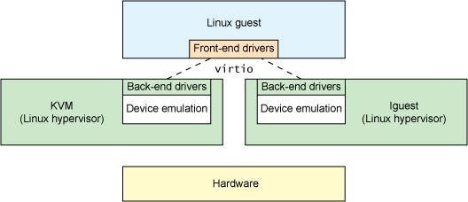
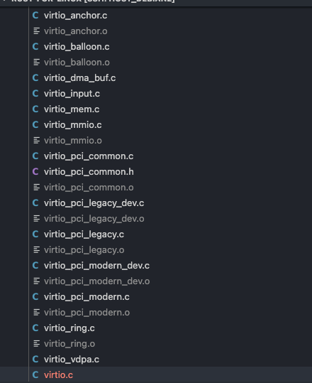
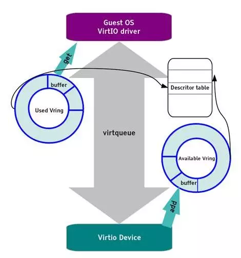
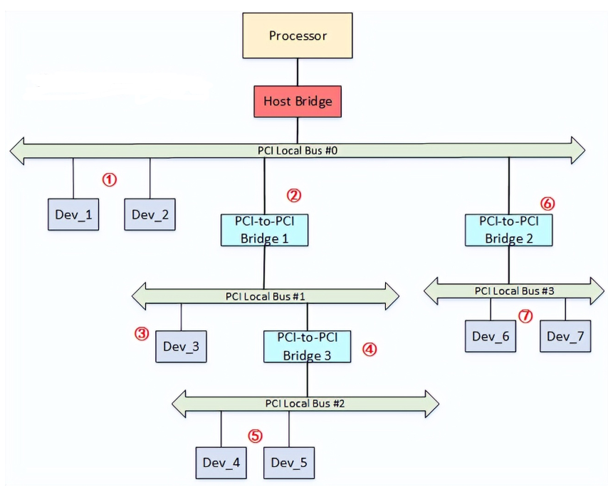

# rust-for-linux—Virtio的实现

## 1.Virtio

> https://docs.oasis-open.org/virtio/virtio/v1.2/virtio-v1.2.html
>
> https://www.openeuler.org/zh/blog/yorifang/virtio-spec-overview.html
>
> https://rcore-os.cn/rCore-Tutorial-Book-v3/chapter9/2device-driver-2.html# 强烈推荐阅读这个
>
> https://zhuanlan.zhihu.com/p/642100699
>
> https://mp.weixin.qq.com/s/Stmj1weLXUg_EzVJfCIB3g
>
> https://mp.weixin.qq.com/s/6qo2xOUdqCEBOXhbKVNZSA





### virtio设备基本组成要素

`virtio`设备的基本组成要素如下：

- 设备状态域（Device status field）
- 特征位（Feature bits）
- 通知（Notifications）
- 设备配置空间（Device Configuration space）
- 一个或多个虚拟队列（virtqueue）


### virtio设备呈现模式

`virtio`设备支持三种设备呈现模式：

- **Virtio Over MMIO**，虚拟设备直接挂载到系统总线上，我们实验中的虚拟计算机就是这种呈现模式；可参考linux内核中`virtio_mmio`
- **Virtio Over PCI BUS**，遵循PCI规范，挂在到PCI总线上，作为virtio-pci设备呈现，在QEMU虚拟的x86计算机上采用的是这种模式；可参考linux内核中`virtio_pci`
- **Virtio Over Channel I/O**：主要用在虚拟IBM s390计算机上，virtio-ccw使用这种基于channel I/O的机制。


### virtio高层架构


在Linux源码中也可以看见在`linux/drivers/virtio` 对`virtio`的实现源码



实现`virtio`的关键在于`virtioqueue`操作

### virtioqueue

virtqueue由三部分组成：

- 描述符表 Descriptor Table：描述符表是描述符为组成元素的数组，每个描述符描述了一个内存buffer 的address/length。而内存buffer中包含I/O请求的命令/数据（由virtio设备驱动填写），也可包含I/O完成的返回结果（由virtio设备填写）等。
- 可用环 Available Ring：一种vring，记录了virtio设备驱动程序发出的I/O请求索引，即被virtio设备驱动程序更新的描述符索引的集合，需要virtio设备进行读取并完成相关I/O操作；
- 已用环 Used Ring：另一种vring，记录了virtio设备发出的I/O完成索引，即被virtio设备更新的描述符索引的集合，需要vrtio设备驱动程序进行读取并对I/O操作结果进行进一步处理。



## 2. 前置知识

要想用rust-for-linux实现virtio,我们首先可以参考一下linux是如何实现的

首先我们把目光看到`virtio.c` 看下我们linux的驱动入口

```c
static int virtio_init(void)
{
	if (bus_register(&virtio_bus) != 0)
		panic("virtio bus registration failed");
	return 0;
}

static void __exit virtio_exit(void)
{
	bus_unregister(&virtio_bus);
	ida_destroy(&virtio_index_ida);
}
core_initcall(virtio_init);
module_exit(virtio_exit);
```

这里进行了`bus_register`方法的调用，要看懂这个操作我们还要理解一下bus、device、device_driver之间的关系

> 在 Linux 内核中，"bus"（总线）是一种抽象概念，它表示一组相互连接的设备和资源。总线提供了设备之间进行通信和协作的框架，使得内核能够有效地管理和控制这些设备。
>
> 总线的概念有助于将设备模型中的各个部分分隔开来，使得内核能够以一致的方式与各种不同类型的设备进行交互。在这个上下文中，"bus" 并不是物理上的电缆或连接，而是一个在软件层面上建立的组织结构。
>
> 在 Linux 内核中，总线可以是硬件总线（如 PCI 总线、USB 总线、I2C 总线等）或虚拟总线（如 sysfs）。总线的注册和管理是通过内核的设备模型来实现的。
>
> 总线的角色包括：
>
> 1. **设备的注册和发现：** 设备驱动可以将自己注册到适当的总线上，从而告诉内核它支持的设备。内核可以在启动时或运行时发现和注册连接到总线上的设备。
> 2. **设备的资源分配：** 总线可以负责为连接到它上面的设备分配和管理资源，如中断、I/O 端口、内存地址等。
> 3. **设备的通信：** 总线提供了设备之间通信的基础。不同设备可以通过总线进行数据传输、同步和协作。
>
> 总线是设备模型的一部分，通过它，内核能够有效地组织、注册和管理系统中的各种设备。总线的概念使得内核能够以一致的方式处理不同类型和架构的设备。
>
> https://docs.kernel.org/driver-api/driver-model/bus.html
> https://mp.weixin.qq.com/s/CIp1ykYasQFKuubV8atE0w
>
> https://mp.weixin.qq.com/s/3pGZXwA9WPPMlWZltu5xMg

### bus_type （总线）

Linux将设备和驱动都挂载在总线上，管理着设备和驱动的注册、匹配、注销等操作，而内核中的每一个bus总线是由`struct bus_type`结构体描述的`bus_type` 的定义如下

```c
struct bus_type {
    const char        *name; // 该总线的名称
    const char        *dev_name; // 当设备的名称为空时，就会以bus->dev_name + device ID呈现
    struct device        *dev_root; // 为该bus的默认父设备
    const struct attribute_group **bus_groups;
    const struct attribute_group **dev_groups;
    const struct attribute_group **drv_groups;

    int (*match)(struct device *dev, struct device_driver *drv);
    int (*uevent)(struct device *dev, struct kobj_uevent_env *env);
    int (*probe)(struct device *dev);
    int (*remove)(struct device *dev);
    void (*shutdown)(struct device *dev);

    int (*online)(struct device *dev);
    int (*offline)(struct device *dev);

    int (*suspend)(struct device *dev, pm_message_t state);
    int (*resume)(struct device *dev);

    int (*num_vf)(struct device *dev);

    int (*dma_configure)(struct device *dev);

    const struct dev_pm_ops *pm;

    const struct iommu_ops *iommu_ops;

    struct subsys_private *p; // 私有数据
    struct lock_class_key lock_key;

    bool need_parent_lock;
};
```

- name: 总线名称，在sysfs中以目录的形式存在，比如i2c总线表现为“/sys/bus/i2c”。
- dev_name:当设备的名称为空时，就会以bus->dev_name + device ID呈现
- bus_groups、dev_groups、drv_groups分别表示bus、device、driver的默认属性attribute，在初始化时自动添加它们。
- match回调函数：当任何属于该bus的device或device_driver添加时，Linux内核都会调用该接口进行匹配处理。
- uevent回调函数：当该属于该bus的device发生添加、删除或其他动作时，bus的核心逻辑会调用该接口，以便bus driver可以修改环境变量。
- probe和remove回调函数：当device和device_driver匹配成功时，将会调用总线的probe实现具体的driver初始化，而总线也有自己的初始化函数，一般地，先调用总线的probe函数，然后在总线probe函数中调用driver的probe函数。相应地，bus提供的remove函数是在一处挂载在设备上的driver时，先执行driver的remove函数，然后再调用ubs的remove函数。
- shutdown、online、offline、suspend、resume、pm是电源管理相关。
- p：bus的私有指针。

下图是PCI的总线图





### device （设备）

Linux内核中描述设备最基本的结构体是`struct device`

```c
struct device {
    struct kobject kobj;
    struct device        *parent;

    struct device_private    *p;

    const char        *init_name; /* initial name of the device */
    const struct device_type *type;

    struct bus_type    *bus;        /* type of bus device is on */
    struct device_driver *driver;    /* which driver has allocated this
                       device */
    void        *platform_data;    /* Platform specific data, device
                       core doesn't touch it */
    void        *driver_data;    /* Driver data, set and get with
                       dev_set_drvdata/dev_get_drvdata */
#ifdef CONFIG_PROVE_LOCKING
    struct mutex        lockdep_mutex;
#endif
    struct mutex        mutex;    /* mutex to synchronize calls to
                     * its driver.
                     */

    struct dev_links_info    links;
    struct dev_pm_info    power;
    struct dev_pm_domain    *pm_domain;

#ifdef CONFIG_GENERIC_MSI_IRQ_DOMAIN
    struct irq_domain    *msi_domain;
#endif
#ifdef CONFIG_PINCTRL
    struct dev_pin_info    *pins;
#endif
#ifdef CONFIG_GENERIC_MSI_IRQ
    struct list_head    msi_list;
#endif

    const struct dma_map_ops *dma_ops;
    u64        *dma_mask;    /* dma mask (if dma'able device) */
    u64        coherent_dma_mask;/* Like dma_mask, but for
                         alloc_coherent mappings as
                         not all hardware supports
                         64 bit addresses for consistent
                         allocations such descriptors. */
    u64        bus_dma_mask;    /* upstream dma_mask constraint */
    unsigned long    dma_pfn_offset;

    struct device_dma_parameters *dma_parms;

    struct list_head    dma_pools;    /* dma pools (if dma'ble) */

#ifdef CONFIG_DMA_DECLARE_COHERENT
    struct dma_coherent_mem    *dma_mem; /* internal for coherent mem
                         override */
#endif
#ifdef CONFIG_DMA_CMA
    struct cma *cma_area;        /* contiguous memory area for dma
                       allocations */
#endif
    /* arch specific additions */
    struct dev_archdata    archdata;

    struct device_node    *of_node; /* associated device tree node */
    struct fwnode_handle    *fwnode; /* firmware device node */

#ifdef CONFIG_NUMA
    int        numa_node;    /* NUMA node this device is close to */
#endif
    dev_t            devt;    /* dev_t, creates the sysfs "dev" */
    u32            id;    /* device instance */

    spinlock_t        devres_lock;
    struct list_head    devres_head;

    struct class        *class;
    const struct attribute_group **groups;    /* optional groups */

    void    (*release)(struct device *dev);
    struct iommu_group    *iommu_group;
    struct iommu_fwspec    *iommu_fwspec;
    struct iommu_param    *iommu_param;

    bool            offline_disabled:1;
    bool            offline:1;
    bool            of_node_reused:1;
#if defined(CONFIG_ARCH_HAS_SYNC_DMA_FOR_DEVICE) || \
    defined(CONFIG_ARCH_HAS_SYNC_DMA_FOR_CPU) || \
    defined(CONFIG_ARCH_HAS_SYNC_DMA_FOR_CPU_ALL)
    bool            dma_coherent:1;
#endif
};
```

在Linux内核中，每个设备都表示为`struct device`的一个实例，该结构体包含了设备模型核心建模所需的信息。`struct device`很少单独使用，更多的是嵌入到一个更高层次的设备结构体中。


- parent：本设备的父节点，大部分情况下，父节点是bus节点或主控制器，如果父节点为NULL，那就是一个（top-level）顶层设备，一般不是我们想要的。
- p：用于保存设备驱动核心部分的私有数据
- kobj：该数据结构对应的struct kobject
- init_name：设备的名称
- type：设备类型
- bus：该设备挂在哪个总线上
- driver：该设备对应的驱动
- platform_data：设备的平台数据，例如：对于定制版的设备，典型的是嵌入式和基于SOC的硬件，linux经常使用platform_data指向该板的数据结构体，描述设备及其链接方式，这可能包含了可用的端口，芯片变量，GPIO等等，这种做法缩小了BSP，并最小化驱动中的#ifdefs。
- driver_data：驱动程序特定数据的指针
- power，pm_domain：和电源管理相关
- pins：设备的引脚管理相关
- dma_ops，dma_mask，bus_dma_mask，dma_pfn_offset，dma_parms，dma_pools，dma_mem：DMA操作相关
- devt：创建sysfs的dev，也叫设备号，一般由Major和Minor两部分组成。


### device_driver （驱动）

Linux内核中描述设备驱动最基本的结构体是`struct device_driver` 

```c
struct device_driver {
    const char        *name; // 驱动名称
    struct bus_type        *bus; // 此驱动程序的设备所属的总线

    struct module        *owner;
    const char        *mod_name;    /* used for built-in modules */

    bool suppress_bind_attrs;    /* disables bind/unbind via sysfs */
    enum probe_type probe_type; // probe类型 synchronous or asynchronous

    const struct of_device_id    *of_match_table; // open firmware匹配表
    const struct acpi_device_id    *acpi_match_table; // ACPI匹配表

    int (*probe) (struct device *dev);
    int (*remove) (struct device *dev);
    void (*shutdown) (struct device *dev);
    int (*suspend) (struct device *dev, pm_message_t state);
    int (*resume) (struct device *dev);
    const struct attribute_group **groups; // 由驱动内核自动创建的默认属性
    const struct attribute_group **dev_groups; // 设备实例绑定到驱动程序后，附加到设备的其他属性

    const struct dev_pm_ops *pm; // power management相关
    void (*coredump) (struct device *dev); // 用于产生uevent

    struct driver_private *p; // 私有数据
};
```


- name，该driver的名称。和device结构一样，该名称非常重要，后面会再详细说明。 
- bus，该driver所驱动设备的总线设备。为什么driver需要记录总线设备的指针呢？因为内核要保证在driver运行前，设备所依赖的总线能够正确初始化。
- owner、mod_name，內核module相关的变量，暂不描述。 
- suppress_bind_attrs，是不在sysfs中启用bind和unbind attribute。在kernel中，bind/unbind是从用户空间手动的为driver绑定/解绑定指定的设备的机制。这种机制是在bus.c中完成的，后面会详细解释。 
- probe、remove，这两个接口函数用于实现driver逻辑的开始和结束。Driver是一段软件code，因此会有开始和结束两个代码逻辑，就像PC程序，会有一个main函数，main函数的开始就是开始，return的地方就是结束。而内核driver却有其特殊性：在设备模型的结构下，只有driver和device同时存在时，才需要开始执行driver的代码逻辑。这也是probe和remove两个接口名称的由来：检测到了设备和移除了设备（就是为热拔插起的！）。
- shutdown、suspend、resume、pm，电源管理相关的内容。
- groups，和struct device结构中的同名变量类似，driver也可以定义一些默认attribute，这样在将driver注册到内核中时，内核设备模型部分的代码（driver/base/driver.c）会自动将这些attribute添加到sysfs中。 
- p，driver core的私有数据指针，其它模块不能访问。


有点抽象画个图

```text
              +-------------+
              |   Device    |
              +-------------+
                      |
               +-------------+
               |     Bus     |
               +-------------+
                      |
               +--------------+
               | Device Driver|
               +--------------+
----------------------分割线---------------------------------------------------------------
            +--------------------------+
            |   Device (struct device) |
            +--------------------------+
                      |
          +--------------------------------+
          |   Bus Type (struct bus_type)    |
          +--------------------------------+
                      |
       +--------------|------------------+
       |              |                  |
+-----------------+ +-----------------+ +------------------+
| Device Driver | | Device Driver | | Device Driver  |
+-----------------+ +-----------------+ +------------------+
|     (struct     | |     (struct     | |     (struct     |
|   device_driver)| |   device_driver)| |   device_driver)|
+-----------------+ +-----------------+ +------------------+
----------------------分割线---------------------------------------------------------------
                             +---------------------+
                             |      Device Tree     |
                             +----------+----------+
                                        |
        +------------------------|---------------------|------------------------+
        |                        |                     |                        |
+------------------+  +------------------+  +------------------+  +------------------+
|   Bus Type A     |  |   Bus Type B     |  |   Bus Type C     |  |   Bus Type D     |
+------------------+  +------------------+  +------------------+  +------------------+
        |                        |                     |                        |
        |                        |                     |                        |
+------------------+  +------------------+  +------------------+  +------------------+
|Device A1|Device A2||Device B1 |Device B2| |Device C1 |Device C2|| Device D1 | Device D2|
+------------------+  +------------------+  +------------------+  +------------------+
  |          |            |          |            |          |            |          |
  |          |            |          |            |          |            |          |
+------------------+  +------------------+  +------------------+  +------------------+
| Driver A1 |Driver A2|Driver B1 |Driver B2|Driver C1 | Driver C2| Driver D1 | Driver D2|
+------------------+  +------------------+  +------------------+  +------------------+
```

- `Device` 表示系统中的实际设备，例如硬件设备或虚拟设备。每个设备都属于一个特定的 `Bus`。
- `Bus` 是设备的集合，它负责管理和组织设备。一个 `Bus` 可以包含多个设备。
- `Device Driver` 是负责与特定设备交互的代码。每个设备都有一个关联的设备驱动程序。


其中Device和Driver是会进行match 匹配的。

在Linux内核中，如果device和device_driver具有相同的名称，内核就会执行device_driver的probe回调函数，来完成device和device_driver的匹配。

执行device_driver的probe回调函数实际上是有bus模块实现的，因为device和driver都挂在在bus总线上，bus总线是最清楚哪个device匹配那个driver。


具体可以阅读[Linux设备模型之device和device_driver](https://mp.weixin.qq.com/s/3pGZXwA9WPPMlWZltu5xMg)以及[Linux设备模型之总线bus](https://mp.weixin.qq.com/s/CIp1ykYasQFKuubV8atE0w)，讲的比较详细。


## 3.virtio-blk

在上面我们了解了`driver`那么我们看一下`virtio_driver`的定义

```c
struct virtio_driver {
	struct device_driver driver;
	const struct virtio_device_id *id_table;
	const unsigned int *feature_table;
	unsigned int feature_table_size;
	const unsigned int *feature_table_legacy;
	unsigned int feature_table_size_legacy;
	int (*validate)(struct virtio_device *dev);
	int (*probe)(struct virtio_device *dev);
	void (*scan)(struct virtio_device *dev);
	void (*remove)(struct virtio_device *dev);
	void (*config_changed)(struct virtio_device *dev);
#ifdef CONFIG_PM
	int (*freeze)(struct virtio_device *dev);
	int (*restore)(struct virtio_device *dev);
#endif
};
```

其中，我们最关键的函数就是`probe`和`remove` ，并且我们可以看到结构体中包含了`device_driver`所以实际上`virtio_driver`就是`device_driver` 


我们现在把目光放在`virtio_blk.c`上模块加载如下

```c
static int __init virtio_blk_init(void)
{
	int error;
	//分配workqueue
	virtblk_wq = alloc_workqueue("virtio-blk", 0, 0);
	if (!virtblk_wq)
		return -ENOMEM;
	//注册新块设备
	major = register_blkdev(0, "virtblk");
	if (major < 0) {
		error = major;
		goto out_destroy_workqueue;
	}
	//注册virtio_driver
	error = register_virtio_driver(&virtio_blk);
	if (error)
		goto out_unregister_blkdev;
	return 0;

out_unregister_blkdev:
	unregister_blkdev(major, "virtblk");
out_destroy_workqueue:
	destroy_workqueue(virtblk_wq);
	return error;
}

static void __exit virtio_blk_fini(void)
{
	unregister_virtio_driver(&virtio_blk);
	unregister_blkdev(major, "virtblk");
	destroy_workqueue(virtblk_wq);
}
module_init(virtio_blk_init);
module_exit(virtio_blk_fini);
```


`register_virtio_driver` 中做的事就是设置driver中的bus然后注册驱动

```c
int register_virtio_driver(struct virtio_driver *driver)
{
	/* Catch this early. */
	BUG_ON(driver->feature_table_size && !driver->feature_table);
	driver->driver.bus = &virtio_bus;
	return driver_register(&driver->driver);
}
```

其中`virtio_bus`的定义如下：

```c
static struct bus_type virtio_bus = {
	.name  = "virtio",
	.match = virtio_dev_match,
	.dev_groups = virtio_dev_groups,
	.uevent = virtio_uevent,
	.probe = virtio_dev_probe,
	.remove = virtio_dev_remove,
};
```

关于注册中最主要的`virtio_driver` 定义：

```c
static struct virtio_driver virtio_blk = {
	.feature_table			= features,
	.feature_table_size		= ARRAY_SIZE(features),
	.feature_table_legacy		= features_legacy,
	.feature_table_size_legacy	= ARRAY_SIZE(features_legacy),
	.driver.name			= KBUILD_MODNAME,
	.driver.owner			= THIS_MODULE,
	.id_table			= id_table,
	.probe				= virtblk_probe,
	.remove				= virtblk_remove,
	.config_changed			= virtblk_config_changed,
#ifdef CONFIG_PM_SLEEP
	.freeze				= virtblk_freeze,
	.restore			= virtblk_restore,
#endif
};
```

我们重点关注`virtblk_probe` 的代码

```c
static int virtblk_probe(struct virtio_device *vdev)
{
    struct virtio_blk *vblk;
    struct request_queue *q;
    int err, index;

    // ... （省略参数声明和错误检查）

    // 为块设备分配索引
    err = allocate_device_index(&index);
    if (err < 0)
        goto out;

    // 为 virtio_blk 结构分配内存
    vblk = allocate_virtio_blk_structure(vdev);
    if (!vblk) {
        err = -ENOMEM;
        goto out_free_index;
    }

    // 初始化 virtio_blk 结构
    err = initialize_virtio_blk_structure(vblk);
    if (err)
        goto out_free_vblk;

    // 初始化块设备的请求队列
    q = initialize_request_queue(vblk);
    if (IS_ERR(q)) {
        err = PTR_ERR(q);
        goto out_cleanup_disk;
    }

    // 配置块设备的其他参数
    configure_block_device_parameters(vdev, vblk, q);

    // 更新块设备容量并标记设备为准备就绪
    virtblk_update_capacity(vblk, false);
    virtio_device_ready(vdev);

    // 向系统添加块设备
    err = add_block_device_to_system(vdev, vblk->disk, virtblk_attr_groups);
    if (err)
        goto out_cleanup_disk;

    return 0;
  ..........
    return err;
}
```

做的事大致如下：

1. 为块设备分配索引（`allocate_device_index`）
2. 为 `virtio_blk` 结构分配内存（`allocate_virtio_blk_structure`）
3. 初始化 `virtio_blk` 结构（`initialize_virtio_blk_structure`）
4. 初始化块设备的请求队列（`initialize_request_queue`）
5. 配置块设备的其他参数（`configure_block_device_parameters`）
6. 更新块设备容量并标记设备为准备就绪（`virtblk_update_capacity` 和 `virtio_device_ready`）
7. 向系统添加块设备（`add_block_device_to_system`）

我们再看一下`virtio_blk` 结构体定义

```c
struct virtio_blk {
	/*
	 * This mutex must be held by anything that may run after
	 * virtblk_remove() sets vblk->vdev to NULL.
	 *
	 * blk-mq, virtqueue processing, and sysfs attribute code paths are
	 * shut down before vblk->vdev is set to NULL and therefore do not need
	 * to hold this mutex.
	 */
	struct mutex vdev_mutex;
	struct virtio_device *vdev;

	/* The disk structure for the kernel. */
	struct gendisk *disk;

	/* Block layer tags. */
	struct blk_mq_tag_set tag_set;

	/* Process context for config space updates */
	struct work_struct config_work;

	/* Ida index - used to track minor number allocations. */
	int index;

	/* num of vqs */
	int num_vqs;
	int io_queues[HCTX_MAX_TYPES];
	struct virtio_blk_vq *vqs;
};
```

这里我们在rust实现中就需要实现这个结构体


未完todo。。。。。。


## 4.rust的相关驱动抽象


